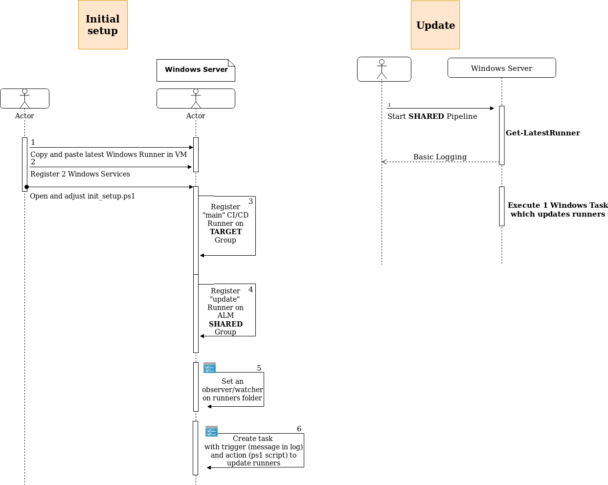

# Setup automatic exchange of GitLab Runners

In order to install GitLab Runner on Windows VM, follow <https://docs.gitlab.com/runner/> guideline.

Rough steps to setup automatic exchange of runners:

1. Install 2 Windows Services by using `Register-GitLabRunner.ps1` - 1 which is used for actual CI/CD jobs (Project A; runner AA) and another one which is used for updating the runner (connected to project B; runner BB).

2. Install 2 Windows Tasks: 1 for folder observer `C:\ALM\runner\bin\runners` (to persist windows reboots) and another one for triggering `Update-OldRunner.ps1`.

==============

1. Trigger start of runner BB to download latest exe file e.g. from nexus repository and move it to the folder which is being observed by the 1st Windows task.

2. Runner BB is then stopped and 2nd Windows task is triggered (due to event logs) which stops all Windows services and exchanges GitLab Runner's exe file.
It then starts Windows Services (i.e. Runners connected to the GitLab) again.

Schema below should be a bit helpful. Otherwise, please contact me.

