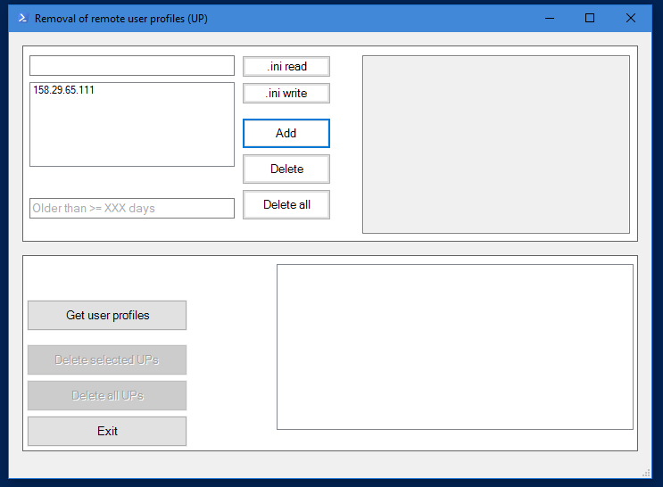

# Various PowerShell scripts

This repository contains various PowerShell scripts that have been developed over the time at my internships and jobs.

## Registering and updating GitLab Runners on Windows Server, automatically

**Problem:** How to update, remotely, GitLab Runners without having access to Windows Server?

**Solution:** The goal is to install, register and setup GitLab Runner on Windows VM in a fashion which allows them to be updated automatically, e.g. through a scheduled pipeline.
This has been successfully tested in production and was (at least initially) aimed for large B2B enterprise applications - those which cannot be put inside K8S or anything like that.

These days, a better approach would be to run RPA software on target machine and code it visually...

## Removal of (remote) user profiles from Windows OS

Inspired & based on a variety of existing source code (see list below), I have developed GUI-based (`WinForms`) application that can simplify deleting user profiles on Windows OS - remotely.

- [X] Capability of creating and reading `ini` files (to the folder where `ps1` is executed)
- [X] Deleting only those user profiles which have been selected by the admin
- [X] Deleting all (remote) profiles
- [X] While internal `PowerShell` console-based logging as well as `WinForms` GUI is in English, a GUI-based logging in the textbox on the right is in German

### Sources:

- https://community.spiceworks.com/how_to/124316-delete-user-profiles-with-powershell
- https://martin77s.wordpress.com/2018/02/14/remove-profiles-from-a-local-or-remote-computer/
- https://www.reddit.com/r/PowerShell/comments/9enay3/delete_user_profiles_remotely/
